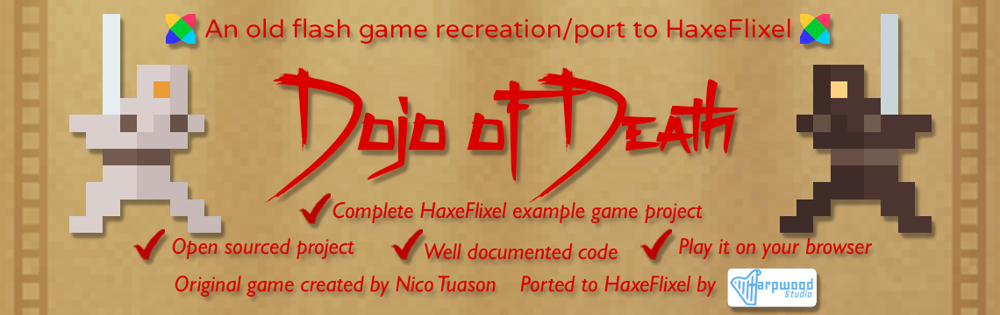

Thank you for checking out the "Dojo of Death" repository! This repository contains the source code of the game "Dojo of Death" that has been ported to HaxeFlixel for educational and nostalgic purposes. I hope this repository serves as a valuable learning resource for HaxeFlixel, providing a complete game example project.

## Play the Game

You can play the game directly in your browser by following this [link](https://harpwood.itch.io/dojo-of-death).

## How to Play

In "Dojo of Death," you take on the role of a white ninja facing relentless waves of black ninjas. Your objective is to survive for as long as possible and achieve an honorable death. Your skills and determination will guide you through the challenges that await.

### Controls

- Move the white ninja: The white ninja always follows the mouse cursor. Simply move the cursor around to control the ninja's movement.
- Attack: Press the left mouse button to unleash powerful attacks against your foes.

### Additional Features

- Pause/Unpause: Press 'P' to pause or unpause the game. Use this feature to take strategic breaks, analyze the battlefield, or attend to urgent matters.
- Mute/Unmute Music: Press 'M' to toggle the music on or off. Customize your audio experience according to your preference.
- Mute/Unmute Sound Effects: Press 'S' to mute or unmute the sound effects. Adjust the audio settings to suit your preferences and immersion.
- Restart: Press 'R' at any time to restart the game. Give yourself a fresh start and test your skills anew.

We hope you enjoy playing "Dojo of Death" and find value in exploring the HaxeFlixel implementation. Have fun and embrace the way of the ninja!

## License

This project is licensed under **a special version of the [MIT License](LICENSE.md)**. Make sure you read it before using or modifying this project. Please also read the [DISCLAIMER](DISCLAIMER.md) before proceeding.

The special version of the MIT License includes additional considerations for the original game assets used in this port. By using this project, you acknowledge and agree that Harpwood Studio does not own the rights to the original game assets and cannot grant specific permissions for their use. It is your responsibility to ensure compliance with any separate licensing or usage restrictions for the original game assets.

## Contributions

Contributions to this project are welcome! If you have any ideas, improvements, or bug fixes, feel free to open an issue or submit a pull request. Let's make this project even better together!